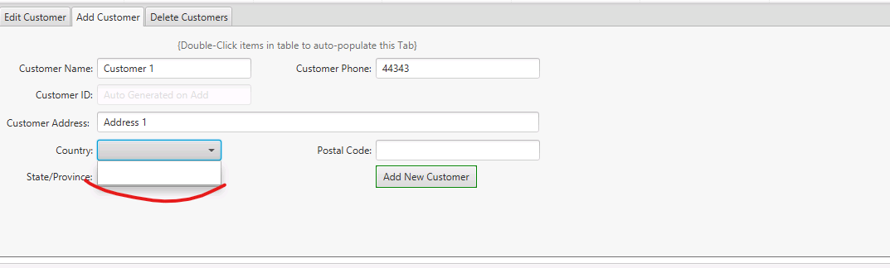
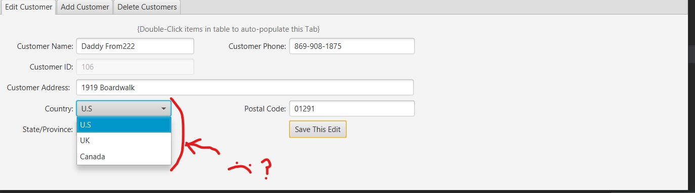

# SCHEDULING APPLICATION
**WGU - C195 - Software II - Advanced Java Concepts**

**Performance Assessment:**
QAM2 TASK 1: JAVA APPLICATION DEVELOPMENT  
Completed: 1/11/2024

Authored By: Cody Choules
Contact: codychls@gmail.com

---
## Description & Usage
**Purpose of the Application:**

This is a "learning project" (created primarily for educational or skill-building purposes) designed to cover a large array of skills using Java & OO Design (Object-Oriented). 

It is an appointment manager that works in conjunction with an existing database. The primary hypothetical purpose of the application is to give a user-friendly GUI (Graphical User Interface) to connect the users to the Data Base. The creation of this hypothetical application is for a contract with a global consulting organization that conducts business in multiple languages, countries, & first level divisions.

A future goal of mine for this project is to use it for a cyber-security war-game using and reorganizing it for an online database as an exploration in front-end exploitation.

Instructions on how to use:  
Login with a DBA (DataBase Adim) administered account and password. User creation has not been implemented. Then you will find yourself in the home tab. The home view tells you the time relative to HQ and you can use the options to the right to access the various functions of the application. In those tabs items can be selected by **DOUBLE CLICKING** to fill the given fields.

---
## Dependencies, Installation, & Configuration

###- Versions Used / Tested -   
Rule of thumb is to utilize version closest to 17.0.9 if unclear
>- OS: Windows 10 x64

>- IDE: [IntelliJ Community Edition **2021.1.3**](https://www.jetbrains.com/idea/download/other.html) (Intergated Dev. Environment)

>- JDK: [**17.0.9**](https://www.oracle.com/java/technologies/downloads/#java17) (Java Dev. Kit)

>- JavaFX SDK: [**17.0.9**](https://gluonhq.com/products/javafx/) (Java 'Effects' Software Dev. Kit)

>- RAD: [Scene Builder **17.0.9**](https://gluonhq.com/products/scene-builder/) (Rapid Application Dev. Tool)

>- POM: [Apache Maven **4.0.0**](https://maven.apache.org/) *Auto implemented with IDE* (Project Object Model)

>- RDBMS: [MySQL **8.0.26**](https://dev.mysql.com/downloads/windows/installer/8.0.html) (Relational DataBase Management System)  
>>  -Selected Products during install:  
    --MySQL Server  
    --MySQL Workbench
  
>- JDBC: [MySQL/Connector/J **8.0.26**](https://dev.mysql.com/downloads/windows/installer/8.0.html) (Java DataBase Connector)


--- 
####Virtual Machine Options:

`--module-path ${PATH_TO_FX} --add-modules javafx.fxml,javafx.controls,javafx.graphics`

_Note: This is found in Edit configurations next to the build/run/debug options. It is under "Modify options">Add VM options

In Settings>Appearance & Behavior>**Path Variables** : add new variable: 
> >Name: `PATH_TO_FX`
> 
> assign the value to the javaFX lib
> 
> Example: 
> >`C:\Users\user\Downloads\C195-setup\openjfx-17.0.9_windows-x64_bin-sdk\javafx-sdk-17.0.9\lib`

---
**- Additional Information & Resources -**

dataBaseReadMe.md in this project has more info on setting up the DataBase

In addition, step-by-step project set-up, installation instructions, & notes are located in this Notion document [C195 Setup - Notion Sharable](https://www.notion.so/C195-Setup-Sharable-0181de44107f4bb7b188e353719dec2d?pvs=4)  
Note: this is not well organized but is in depth.
---

## Out Of Scope Features
During this project I included a number of features that were not included in the project scope. Below are those features and why they were included

>Dark mode 
> > Personal Goal to implement as white light is extremely irritating to my eyes & many programs do not have the feature.

> Manual Language Switching
> > This DOES NOT prevent the application from detecting default system language. But, it would be necessary as Canada is a bi-lingual country, and the feature helped in implementation/testing.

> Search Function
> > Table
> > > Did not realize it was not required
> 
> > ComboBoxes
> > > When starting the code for the combo boxes I wanted to include an easy way to implement search amongst hundreds of items. Unfortunately, it turned out to be a bad idea as JFX ComboBox Skin has a number of unintuitive default settings and bugs at least in the way I wanted to interact with them.

---
## Additional Report

As required by rubric A3f I made the following report with the following tables.

> __Customer Totals Report__  
> This is meant to display information on customer distribution & acquisition.
> 
> > Customers By Country  
> This displays the total Customers per Country
> 
> > Customers By Division  
> This displays the total Customers per First level division.
>
> > Customers Gained By Month  
> This displays the total Customers created per month.

## Issues

The biggest issues are javaFX related. The combo box skin is still a little buggy despite disabling default listeners which had an even worse bug. The table element is not easily resizable and does not want to properly size itself to display contents in proportion. Both of these are aesthetic in effect and are fully functioning otherwise. 

## Evaluation Corrections:

####A2. Customer Record Functionalities (fixed)
>The application provides forms for entering and maintaining customers.
> 
> Issues:
>
>
>>Attempts to remove customers with associated appointments generate an error in the console. See the attached image, Aspect_A2_1.PNG.  
>> 
>> **Cody**: This does not occur with my local DB as it automatically deletes child KR rows. IDK why this asymmetry (See ReadMeForDataBase.md to see how I set up my Data base) exists. I Will modify code to delete Child Appointment rows before deletion:  
>>         
>>```
>>//Deletes Child Rows. before Parent is deleted
>>String childQuery = "DELETE FROM appointments WHERE Customer_ID=?";
>>PreparedStatement childPreparedStatement = connection.prepareStatement(childQuery);
>>childPreparedStatement.setInt(1, customerId);
>>childPreparedStatement.executeUpdate();
>>```
> 
>>The Country and State/Province fields are empty. See the attached image, Aspect_A2_2.PNG. 
>> 
>> Cody: I am not replicating this Error (See image). I will look into combo box code on ViewCustomers.
>> 
>> Cody: Never mind. It occurs only on add appointment not on update Fixing:  
>>```
>>public void initialComboBoxLoadFromDB() throws SQLException {
>>    CRCountryDropDown.setItems(CountryDAO.getCountryNames());
>>    CRFirstLvlDivDropDown.setItems(FirstLvlDivisionDAO.getFLD_Names());
>>    CRCountryDropDown1.setItems(CountryDAO.getCountryNames()); //Added
>>    CRFirstLvlDivDropDown1.setItems(FirstLvlDivisionDAO.getFLD_Names());
>>```

####A3a. Scheduling Functionality: Add, Update, and Delete

> The application provides forms for entering and maintaining appointments.
> > The submission allows entering appointments with a start time after the end time. See the attached image, Aspect_A3a_1.PNG.
>> 
> > **Cody**: Adding isStartBeforeEnd() boolean in Appointment class & implementing warning.
> > ```
> >  public boolean isStartBeforeEnd(){
>>        if (this.getApStart().isAfter(this.getApEnd())) {
>>            return false;
>>        } else {
>>            return true;
>>        }
>>    }
> > ```
> >
> 
> > The functionality to update an appointment title, location etc., without changing the appointment date or time was not observed. (It appears the appointment is checking for a conflict with itself).  
> > **Cody**: I removed the appointment from the list of appointments to detect overlap using a different method that only uses the ID instead of using the object.
> > ```
>>    public boolean isNotOverlapping() throws SQLException {
>>
>>        ObservableList<Appointment> apListByCustomer = AppointmentDAO.getAllAppointmentsByCustomer(this.apCustomerID);
>>        //To prevent overlap detection with itself
>>        apListByCustomer.remove(this); //Original solution //Leaving For Redundancy
>>        apListByCustomer.removeIf(appointment -> this.apID == appointment.apID);//suggested by IDE
>>```

####A3c. Time Zones

>The application indicates the user's timezone on the login form. Appointment timeframes were not appropriately adjusted to reflect the change in time zones. See the attached images Aspect_A3c_1.PNG and Aspect_A3c_2.PNG.
> 
> 
 > > **Cody**: I spent a long time on this one creating a new class. This class called TimeGetterTool just converts time from utc and to Utc for the system and business time. Implemented it at the Data Access points and tested. With the simplified conversion method I could clearly see the time was converted properly and knew my conversions were no longer the problem. The problem still persisted in certain time zones. My times would shift a time value not equal toe the time offset another sign it was not my conversion method. Further, testing and debugging found it was occurring on Timestamp access from the database. Timestamp to localDateTime was using a nonsensical offset. I think it may be a DB rule, or a misunderstanding on my part for timestamp to localDateTime. I used String to access the data, and the problem was fixed hopefully this will make the program less fragile to these types of rules. I have removed most of time stamp except for when it is used to convert the strings into LocalDateTimes as for some reason the issue does not occur there which adds to the evidence that it is a timestamp database thing or a bug.
 > ```
>            String apType = resultSet.getString("Type");
>            String startString = resultSet.getString("Start");
>            String endString = resultSet.getString("End");
>            //LocalDateTime apStart = resultSet.getTimestamp("Start").toLocalDateTime();
>            //to local date time is shifting my timestamp 2.5 hours down. Now 2.75, must be a db problem getting time string does not do this.
>            //The 2.5 time shift makes no sense as I am testing it is -9 zone so it should be shifting 9 not 2
>            //LocalDateTime apEnd = resultSet.getTimestamp("End").toLocalDateTime();
>            int apCustomerID = resultSet.getInt("Customer_ID");
>```
> 
#### A3e. Alerts

> The application provides functionality for entering appointments. The alert message states there are upcoming appointments scheduled even if no appointment is scheduled within 15 minutes of logging in. See the attached images Aspect_A3e_1.PNG and Aspect_A3e_2.PNG.
> 
> 
> 
> 
>  **Cody**: I tested this in three different time zones and got the following:
> 
> 
> 
> So it is working. In this example it is 35 on the hour, and the appointment is in ten min and is detected while the other app not detected. I do not know how to replicate the error found in the review.  In addition, there is a chance that correcting the Timestamp behavior corrected this error. Note for future sessions with git: I should branch from main when I start and commit after every correction/problem fix, so I can test without previous fixes altering my results.
> 
>  ```
>            String apType = resultSet.getString("Type");
>            String startString = resultSet.getString("Start");
>            String endString = resultSet.getString("End");
>            //LocalDateTime apStart = resultSet.getTimestamp("Start").toLocalDateTime();
>            //to local date time is shifting my timestamp 2.5 hours down. Now 2.75, must be a db problem getting time string does not do this.
>            //The 2.5 time shift makes no sense as I am testing it is -9 zone so it should be shifting 9 not 2
>            //LocalDateTime apEnd = resultSet.getTimestamp("End").toLocalDateTime();
>            int apCustomerID = resultSet.getInt("Customer_ID");
>```

#### Javadoc Comments

> The submission includes a Javadoc folder. Some HTML files are not observed. For example, the 'ViewAppointments.html' file related to the ViewAppointments class is not observed. 
> 
> **Cody**: This is occurring because I am using & symbol in my comments causing an HTML error. Note for latter use: I may be able to convert in the command line options for creating JavaDocs which would allow me to continue using "&".  
> For now I will refractor all " & " (with spaces on each side) to convert to " and ".