## Evaluation Corrections:

####A2. Customer Record Functionalities (fixed)
>The application provides forms for entering and maintaining customers.
>
> Issues:
>
>
>>Attempts to remove customers with associated appointments generate an error in the console. See the attached image, Aspect_A2_1.PNG.  
>> 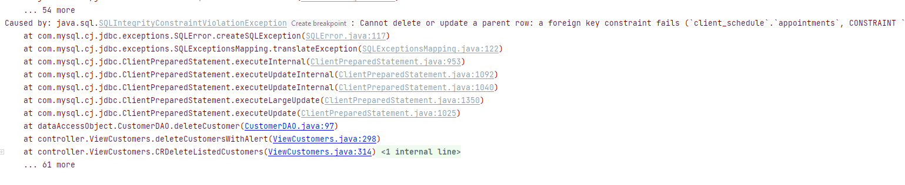
>> **Cody**: This does not occur with my local DB as it automatically deletes child KR rows. IDK why this asymmetry (See ReadMeForDataBase.md to see how I set up my Data base) exists. I Will modify code to delete Child Appointment rows before deletion:
>>
>>```
>>//Deletes Child Rows. before Parent is deleted
>>String childQuery = "DELETE FROM appointments WHERE Customer_ID=?";
>>PreparedStatement childPreparedStatement = connection.prepareStatement(childQuery);
>>childPreparedStatement.setInt(1, customerId);
>>childPreparedStatement.executeUpdate();
>>```
>
>>The Country and State/Province fields are empty. See the attached image, Aspect_A2_2.PNG.
>> 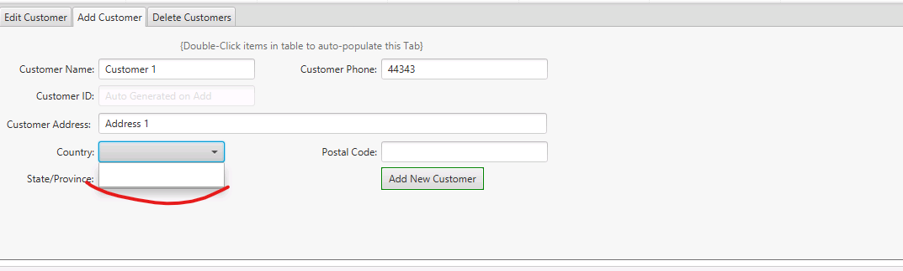
>> Cody: I am not replicating this Error (See image). I will look into combo box code on ViewCustomers.
>> 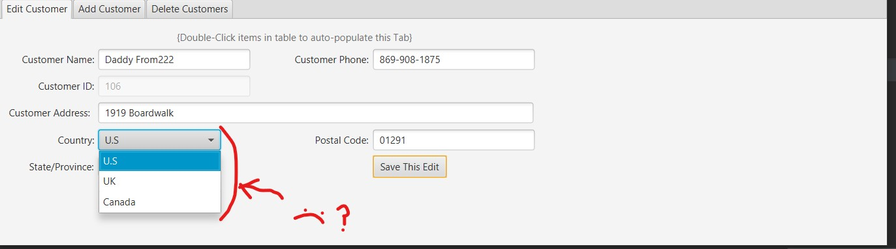
>> Cody: Never mind. It occurs only on add appointment not on update Fixing:
>>```
>>public void initialComboBoxLoadFromDB() throws SQLException {
>>    CRCountryDropDown.setItems(CountryDAO.getCountryNames());
>>    CRFirstLvlDivDropDown.setItems(FirstLvlDivisionDAO.getFLD_Names());
>>    CRCountryDropDown1.setItems(CountryDAO.getCountryNames()); //Added
>>    CRFirstLvlDivDropDown1.setItems(FirstLvlDivisionDAO.getFLD_Names());
>>```

####A3a. Scheduling Functionality: Add, Update, and Delete

> The application provides forms for entering and maintaining appointments.
> > The submission allows entering appointments with a start time after the end time. See the attached image, Aspect_A3a_1.PNG.
>> 
> > **Cody**: Adding isStartBeforeEnd() boolean in Appointment class & implementing warning.
> > ```
> >  public boolean isStartBeforeEnd(){
>>        if (this.getApStart().isAfter(this.getApEnd())) {
>>            return false;
>>        } else {
>>            return true;
>>        }
>>    }
> > ```
> >
>
> > The functionality to update an appointment title, location etc., without changing the appointment date or time was not observed. (It appears the appointment is checking for a conflict with itself).  
> > **Cody**: I removed the appointment from the list of appointments to detect overlap using a different method that only uses the ID instead of using the object.
> > ```
>>    public boolean isNotOverlapping() throws SQLException {
>>
>>        ObservableList<Appointment> apListByCustomer = AppointmentDAO.getAllAppointmentsByCustomer(this.apCustomerID);
>>        //To prevent overlap detection with itself
>>        apListByCustomer.remove(this); //Original solution //Leaving For Redundancy
>>        apListByCustomer.removeIf(appointment -> this.apID == appointment.apID);//suggested by IDE
>>```

####A3c. Time Zones

>The application indicates the user's timezone on the login form. Appointment timeframes were not appropriately adjusted to reflect the change in time zones. See the attached images Aspect_A3c_1.PNG and Aspect_A3c_2.PNG.
> 
> 
> > **Cody**: I spent a long time on this one creating a new class. This class called TimeGetterTool just converts time from utc and to Utc for the system and business time. Implemented it at the Data Access points and tested. With the simplified conversion method I could clearly see the time was converted properly and knew my conversions were no longer the problem. The problem still persisted in certain time zones. My times would shift a time value not equal toe the time offset another sign it was not my conversion method. Further, testing and debugging found it was occurring on Timestamp access from the database. Timestamp to localDateTime was using a nonsensical offset. I think it may be a DB rule, or a misunderstanding on my part for timestamp to localDateTime. I used String to access the data, and the problem was fixed hopefully this will make the program less fragile to these types of rules. I have removed most of time stamp except for when it is used to convert the strings into LocalDateTimes as for some reason the issue does not occur there which adds to the evidence that it is a timestamp database thing or a bug.
> ```
>            String apType = resultSet.getString("Type");
>            String startString = resultSet.getString("Start");
>            String endString = resultSet.getString("End");
>            //LocalDateTime apStart = resultSet.getTimestamp("Start").toLocalDateTime();
>            //to local date time is shifting my timestamp 2.5 hours down. Now 2.75, must be a db problem getting time string does not do this.
>            //The 2.5 time shift makes no sense as I am testing it is -9 zone so it should be shifting 9 not 2
>            //LocalDateTime apEnd = resultSet.getTimestamp("End").toLocalDateTime();
>            int apCustomerID = resultSet.getInt("Customer_ID");
>```
>
#### A3e. Alerts

> The application provides functionality for entering appointments. The alert message states there are upcoming appointments scheduled even if no appointment is scheduled within 15 minutes of logging in. See the attached images Aspect_A3e_1.PNG and Aspect_A3e_2.PNG.
>
> 
> 
>
>  **Cody**: I tested this in three different time zones and got the following:
>
> 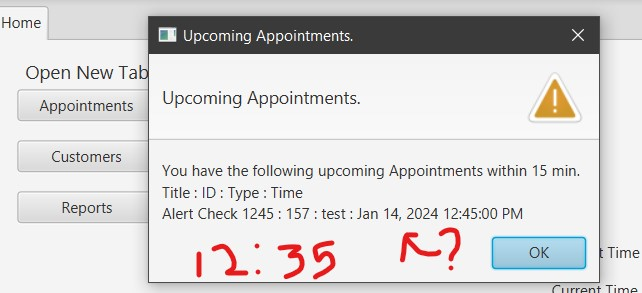
>
> So it is working. In this example it is 35 on the hour, and the appointment is in ten min and is detected while the other app not detected. I do not know how to replicate the error found in the review.  In addition, there is a chance that correcting the Timestamp behavior corrected this error. Note for future sessions with git: I should branch from main when I start and commit after every correction/problem fix, so I can test without previous fixes altering my results.
>
>  ```
>            String apType = resultSet.getString("Type");
>            String startString = resultSet.getString("Start");
>            String endString = resultSet.getString("End");
>            //LocalDateTime apStart = resultSet.getTimestamp("Start").toLocalDateTime();
>            //to local date time is shifting my timestamp 2.5 hours down. Now 2.75, must be a db problem getting time string does not do this.
>            //The 2.5 time shift makes no sense as I am testing it is -9 zone so it should be shifting 9 not 2
>            //LocalDateTime apEnd = resultSet.getTimestamp("End").toLocalDateTime();
>            int apCustomerID = resultSet.getInt("Customer_ID");
>```

#### Javadoc Comments

> The submission includes a Javadoc folder. Some HTML files are not observed. For example, the 'ViewAppointments.html' file related to the ViewAppointments class is not observed.
>
> **Cody**: This is occurring because I am using & symbol in my comments causing an HTML error. Note for latter use: I may be able to convert in the command line options for creating JavaDocs which would allow me to continue using "&".  
> For now I will refractor all " & " (with spaces on each side) to convert to " and ".


##Evaluation Corrections 2:

#### A2. Customer Record Functionalities

> The submission includes a Java application. Attempts to go to the Customers option generate an error in the console that states "LoadException." See the attached image Aspect_A2_1.PNG.
>   
> 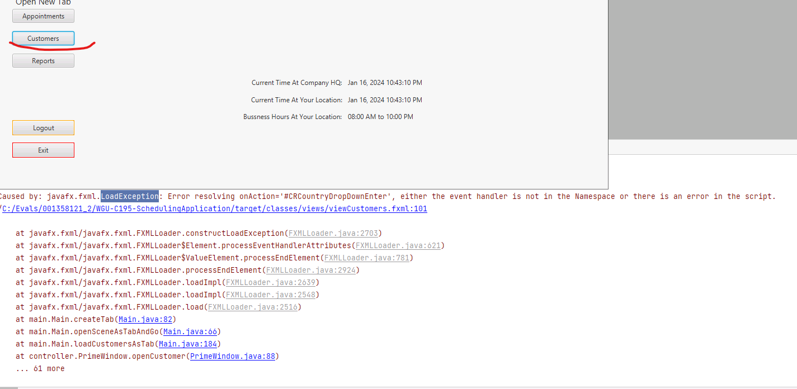
>
> **Cody**: Fixed:
> 
> > 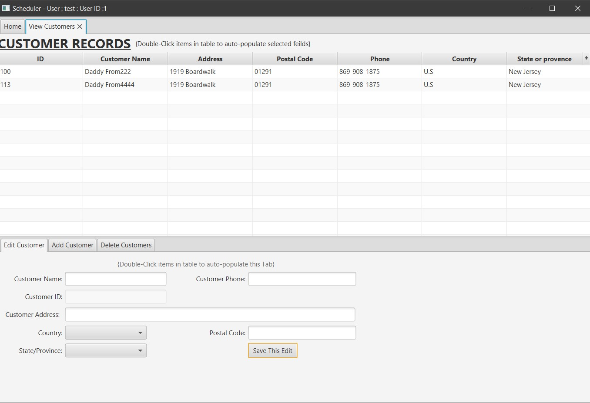

#### A3a. Scheduling Functionality: Add, Update, and Delete

> The application provides forms for entering and maintaining appointments. Not all the fields are populated when the user edits an existing appointment. See the sequence of images Aspect_A3a_1.PNG, Aspect_A3a_2.PNG, and Aspect_A3a_3.PNG.
>
> 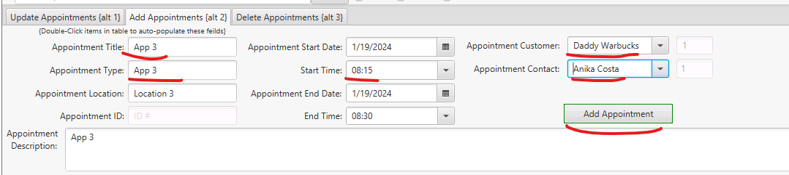
> 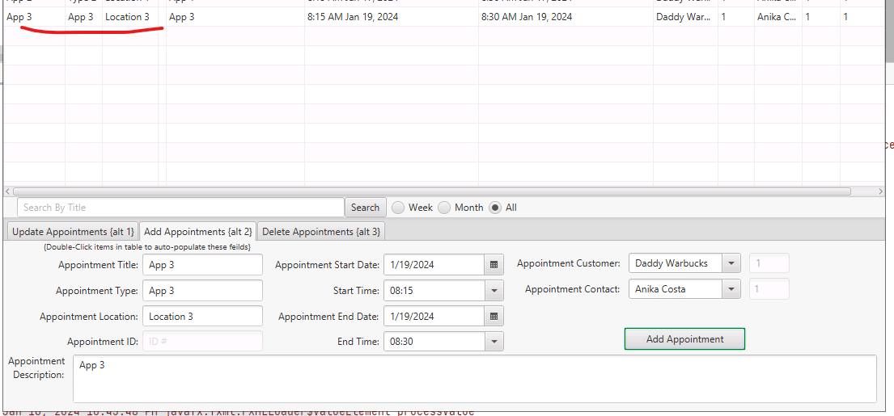
> 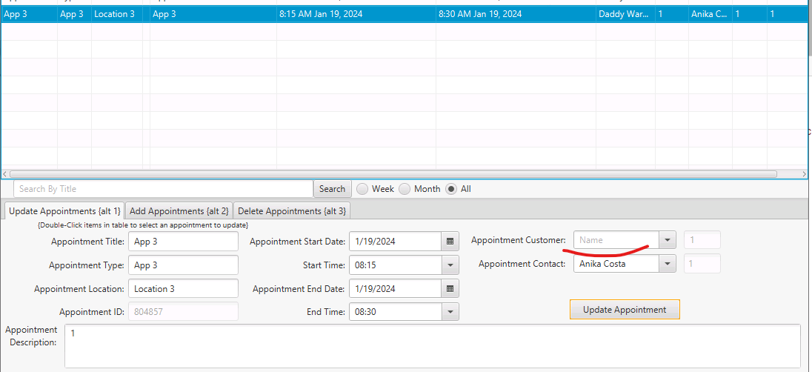
> 
> > **Cody**: Fixed:
> >```
> > apCustomerIdUpdate.setText(String.valueOf(selectedAp.getApCustomerId()));            apContactUserIdUpdate.setText(String.valueOf(selectedAp.getApUserId()));
> >            //apContactUpdate.setItems(contactNames);
> >            //add contact name . set value . selectedAp . getContactName
> >            apContactUpdate.setValue(String.valueOf(selectedAp.getApContactName()));
> >            // TODO [c] make "contactName" in appointment obj getting it from Contact
> >            apDescriptionUpdate.setText(String.valueOf(selectedAp.getApUserId()));
> >            apCustomerUpdate.setValue(String.valueOf(selectedAp.getApCustomerName()));
> >```
 > 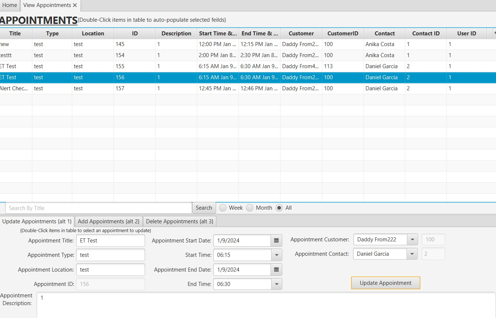


#### A3d. Input validation and logical error checks

> The application provides an implementation of exception controls, including functionality for preventing invalid login credentials and appointments outside of business hours. Overlapping appointments are allowed to be scheduled. See the attached image Aspect_A3d_1.PNG.
>
> 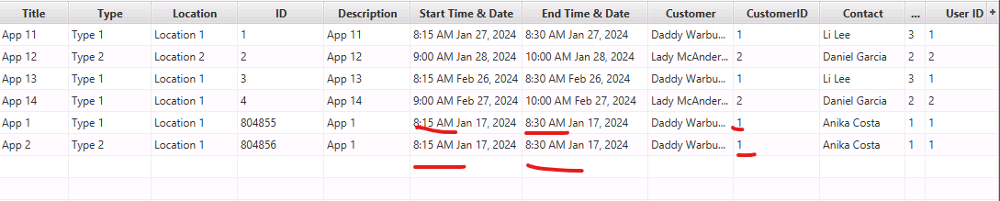
> 
> **Cody**: I cannot replicate this error:
> 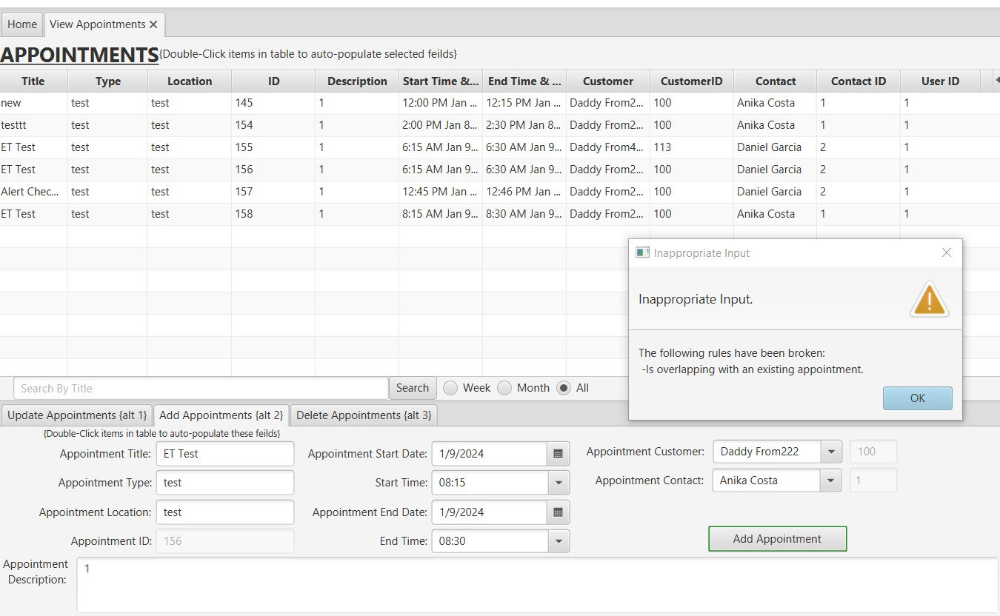
> Trying again on the virtual machine reveals issue with the DAO getting values based on customer ID switched to using Get All then removing non-matching:
> 
> ```aidl
>    public static ObservableList<applicationObject.Appointment> getAllAppointmentsByCustomer(int customerID) throws SQLException {
>
>
>        ObservableList<Appointment> appointmentsObservableList = getAllAppointments();
>
>        appointmentsObservableList.removeIf(appointment -> appointment.getApCustomerId() != customerID);
>
>        return appointmentsObservableList;
>    }
>```
> 
> 
> 
#### A3e. Alerts

> The submission includes a Java application. The alert displays all the appointments. The alert needs to display only the upcoming appointments in the next 15 minutes. See the sequence of images Aspect_A3e_1.PNG and Aspect_A3e_2.PNG.
>
> 
> 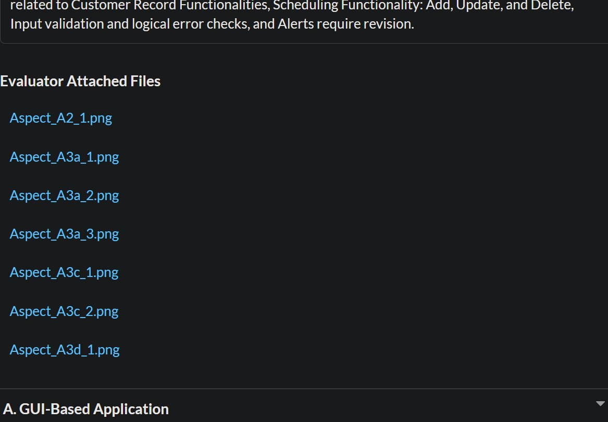
> **Cody**: I cannot replicate this error:
> 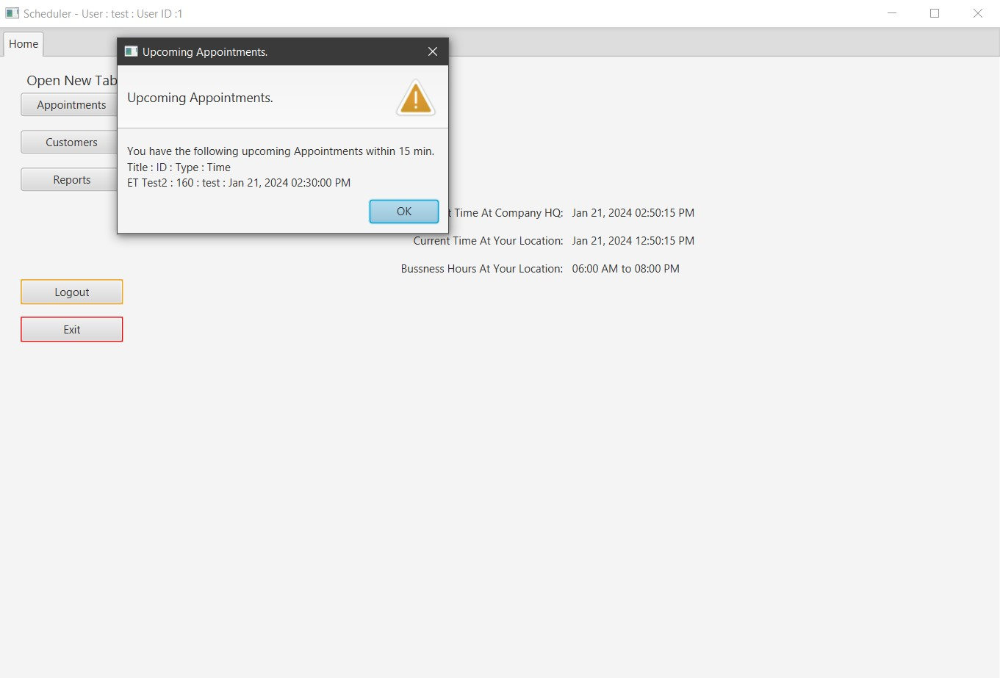
> 